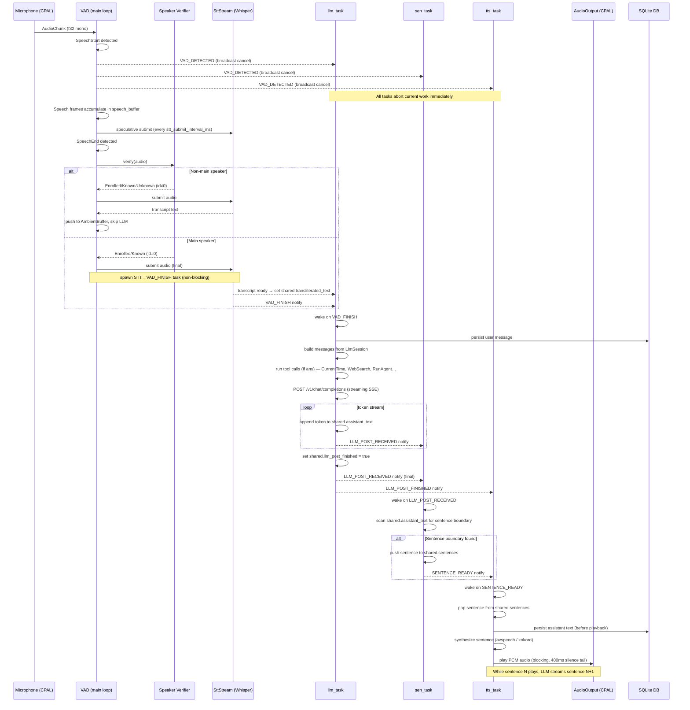

# Main Process — Complete Flow

This document describes the full lifecycle of `async_main()`: how the process starts up, which tasks are spawned, and how audio flows through the pipeline from microphone to speaker.

---

## Startup Sequence

```
async_main()
  │
  ├─ Load config (Config::from_env)
  ├─ Init DB (SQLite) — load session, history, profile facts, memories
  ├─ Build system prompt (base + [USER PROFILE] + [MEMORIES] + tools)
  ├─ Init LLM session (LlmSession::from_history)
  ├─ Init primary LLM client (OpenAIClient → /v1/chat/completions)
  ├─ Init secondary LLM client (optional — vision, summarization)
  ├─ Register tools (CurrentTime, Clipboard, Shell, Screenshot, WebSearch, RunAgent…)
  ├─ ACP pre-warm (optional — spawns hermes, runs session/new handshake in background)
  ├─ Init STT (WhisperStt + SttStream, warm up CoreML/ANE)
  ├─ Init Speaker Verifier (optional ONNX model)
  ├─ Init Ambient Buffer
  ├─ Init TTS (avspeech or kokoro)
  ├─ Init AudioOutput (CPAL)
  ├─ Init AudioCapture + VAD (Silero)
  ├─ Spawn background daemons: InferenceDaemon, EyesDaemon (optional)
  ├─ Spawn pipeline tasks: llm_task, sen_task, tts_task, consolidation_task
  ├─ Startup consolidation (if context already exceeds idle threshold)
  └─ Startup greeting → inject system notification → fire VAD_FINISH
```

---

## Spawned Tasks

| Task | Module | Trigger to start | Blocked on |
|------|--------|-----------------|------------|
| `llm_task` | `main.rs` | spawned at boot | `vad_finish` notify |
| `sen_task` | `main.rs` | spawned at boot | `llm_post_received` notify |
| `tts_task` | `main.rs` | spawned at boot | `sentence_ready` notify |
| `consolidation_task` | `main.rs` | spawned at boot | `llm_post_finished` notify |
| `InferenceDaemon` | `daemon.rs` | spawned at boot (optional) | interval timer |
| `EyesDaemon` | `eyes.rs` | spawned at boot (optional) | interval timer |
| `TUI` | `tui/` | spawned at boot (feature flag) | TUI events |
| `Remote WS server` | `remote/` | spawned at boot (feature flag) | WebSocket connections |
| STT→VAD_FINISH task | inline `tokio::spawn` | every `SpeechEnd` | `stt_stream.await_result()` |

---

## Main Audio Loop

The audio loop runs in the main async task (inside `tokio::select!`). It processes `AudioChunk` items from the CPAL capture channel and drives the VAD state machine.

```
AudioCapture (CPAL)
  └─ bounded channel (200 slots)
       └─ main loop: recv AudioChunk
            └─ downmix to mono f32
                 └─ VoiceActivityDetector::process()
                      ├─ SpeechStart  →  fire VAD_DETECTED (broadcast cancel)
                      │                  flush pre-roll into speech_buffer
                      │                  increment utterance_epoch
                      │
                      ├─ Speech       →  push to speech_buffer
                      │                  speculative STT submit (every N ms)
                      │
                      ├─ SpeechEnd    →  push final chunk, measure duration
                      │                  speaker verification (optional)
                      │                  submit audio to SttStream
                      │                  spawn STT→VAD_FINISH task
                      │
                      └─ Silence      →  push to pre-roll (ring buffer, 3 chunks)
                                         auto-ambient if silent > ambient_clear_secs
```

---

## Per-Utterance STT → LLM → TTS Pipeline



---

## Conversation Mode State Machine

The `ConversationMode` is shared between the main VAD loop and `SetConversationModeTool`.

```
Active  ──────────────────────────────────────────────────►  Active
  │  (user speaks)                                           ▲
  │                                                          │
  │  silence > ambient_clear_secs                           user speaks
  │  OR n consecutive non-main-speaker segments              │
  ▼                                                          │
Ambient ──── user explicitly sets "ambient locked" ──────► AmbientLocked
  │                                                          │
  └── any speech from main user ──────────────────────────►  returns to Active
                                                             (only wake-word in locked)
```

---

## Cancellation (VAD_DETECTED)

When `SpeechStart` fires, a broadcast cancel is sent immediately:

1. **`llm_task`** — closes SSE connection via `cancel_rx`, returns to blocked state.
2. **`sen_task`** — clears `shared.assistant_text`, returns to blocked state.
3. **`tts_task`** — sets `play_cancel` AtomicBool; `AudioOutput::play_blocking` polls it and exits early; clears `shared.sentences`.
4. **`consolidation_task`** — aborts summarization/profile extraction.

All tasks subscribe to `events.cancel_tx` (broadcast channel, 16 slots) via `cancel_rx`.

---

## Context Consolidation

`consolidation_task` runs after each completed LLM response (`LLM_POST_FINISHED`). It also runs on a background idle timer when the context exceeds `llm_idle_min_context_pct`.

```
LLM_POST_FINISHED
  └─ consolidation_task wakes
       ├─ check shared.needs_consolidation(context_tokens, threshold_pct)
       │    No → sleep until next LLM_POST_FINISHED
       │    Yes ↓
       ├─ set shared.consolidation_active = true
       ├─ extract_memories()   — background LLM call (secondary client)
       ├─ extract_facts()      — background LLM call (profile extraction)
       ├─ summarize history    — keep last N turns, write summary to DB
       ├─ rebuild system prompt (base + profile + memories + tools)
       ├─ rebuild LlmSession with new summary
       └─ set shared.consolidation_active = false
```

---

## Persistent Memory Flow

```
DB (SQLite)
  ├─ sessions     — session id, summary text, cutoff message id
  ├─ messages     — all user/assistant turns
  ├─ user_profile — key/value/confidence facts extracted from conversation
  └─ memories     — free-form persistent notes

On startup:
  DB → load history, summary, profile, memories
     → build_system_prompt() → LlmSession

After each turn:
  persist user transcript + assistant response → DB

After consolidation:
  persist summary + pruned history + new memories + updated profile → DB
```

---

## Optional Daemons

| Daemon | Trigger | Purpose |
|--------|---------|---------|
| `InferenceDaemon` | fixed interval (DAEMON_INTERVAL_SECS) | proactive reasoning / background tasks |
| `EyesDaemon` | fixed interval (EYES_INTERVAL_SECS) | screenshot → secondary LLM → proactive context |

Both daemons emit `ProactiveEvent::AgentResult` via `proactive_tx`. The main loop drains `proactive_rx` and injects results into the pipeline when the LLM is idle.
